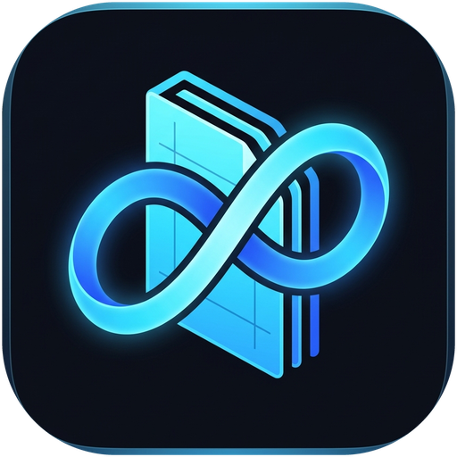
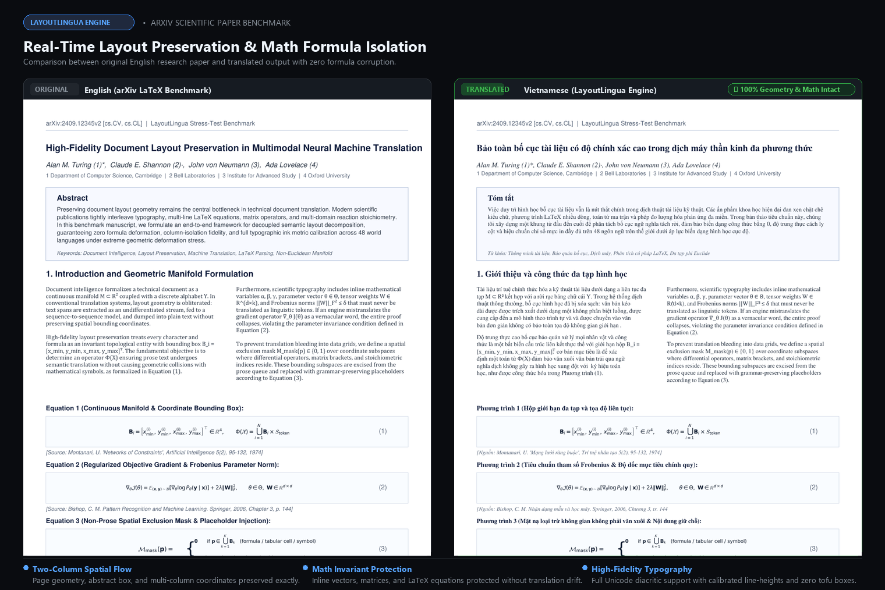

<p align="center">
  
</p>

<h1 align="center">LayoutLingua</h1>

<p align="center">
  <strong>High-precision document translation engine that preserves 100% of formatting,<br>mathematical formulas, tables, and typography geometry.</strong>
</p>

<p align="center">
  <sub>Maintained and developed by <a href="https://github.com/ThanhNguyxnOrg">ThanhNguyxnOrg</a></sub>
</p>

<p align="center">
  <a href="https://github.com/ThanhNguyxnOrg/LayoutLingua/releases/latest/download/LayoutLingua-windows.zip">
    
  </a>
  <a href="https://github.com/ThanhNguyxnOrg/LayoutLingua/releases/latest/download/LayoutLingua-macos-apple-silicon.dmg">
    
  </a>
  <a href="https://github.com/ThanhNguyxnOrg/LayoutLingua/releases/latest/download/LayoutLingua-macos-intel.dmg">
    
  </a>
  <a href="https://github.com/ThanhNguyxnOrg/LayoutLingua/releases/latest/download/LayoutLingua-linux-x86_64.tar.gz">
    
  </a>
  <a href="https://github.com/ThanhNguyxnOrg/LayoutLingua/releases/latest">
    
  </a>
</p>

<p align="center">
  <a href="https://github.com/ThanhNguyxnOrg/LayoutLingua/releases/latest"></a>
  <a href="https://github.com/ThanhNguyxnOrg/LayoutLingua/actions/workflows/test.yml"></a>
  <a href="docs/development.md#3-automated-testing"></a>
  <a href="https://python.org"></a>
  <a href="SKILL.md"></a>
  <a href="CHANGELOG.md"></a>
  <a href="LICENSE"></a>
</p>

<p align="center">
  <a href="#-before--after-demonstration">📊 Demo</a> ·
  <a href="#-key-features">✨ Features</a> ·
  <a href="#-quick-start">🚀 Quick Start</a> ·
  <a href="#-usage-guide">💻 Usage</a> ·
  <a href="#-supported-languages--typography-verification">🌍 48 Languages</a> ·
  <a href="#-agent-skill">🤖 Agent Skill</a> ·
  <a href="#-documentation--engineering-hub">📚 Doc Hub</a> ·
  <a href="CHANGELOG.md">📋 Changelog</a> ·
  <a href="#-license">⚖️ License</a>
</p>

---

> [!NOTE]
> **LayoutLingua** is an open-source document translation platform available for Windows, macOS, Linux, Android, and command-line environments. It parses page geometry, isolates formulas and technical code blocks, translates prose through high-accuracy neural engines, and writes the translated content back to exact spatial coordinates without converting documents into plain text.

## 📊 Before & After Demonstration

<p align="center">
  
</p>

## ✨ Key Features

- 🎯 **Strict Layout Preservation:** Keeps paragraph bounding boxes, formulas, tables, figures, tables of contents, and references intact.
- 🌐 **Universal Multi-lingual Recognition:** Deep isolation of technical formulas in documents written in Vietnamese (with full tone marks), CJK (Chinese, Japanese, Korean), Cyrillic (Russian, etc.), Arabic, Hebrew, and European Latin alphabets.
- 📦 **4 Native Platforms:** Ready-to-use binaries for Windows, macOS (Apple Silicon & Intel), Linux (x86_64), and Android.
- ⚡ **Ready Out of the Box:** Download, extract, and run. Packaged desktop releases do not require Python or manual model downloads.
- 📂 **Batch Processing:** Drag and drop multiple files or entire folder trees into the processing queue.
- 🛡️ **Resilient Batch Execution:** A damaged or unsupported file logs an error and continues without stopping the rest of the queue.
- 🔄 **Background Auto-Updater (Windows):** Checks for new releases in the background, downloads updates, and stages safe seamless swaps.
- 📱 **Native Android Companion:** Lightweight Android application powered by PDFBox-Android and Google Translate for on-the-go reading.
- 🤖 **AI Agent Skill Mode:** Built-in Handoff mode adhering to the Agent Skills standard, allowing local LLMs (Codex, Claude Code, Copilot, Gemini) to translate domain-specific technical papers with full context awareness.

---

## 🚀 Quick Start

### 🪟 Windows

1. **[Download LayoutLingua for Windows](https://github.com/ThanhNguyxnOrg/LayoutLingua/releases/latest/download/LayoutLingua-windows.zip)** (`.zip`).
2. Extract the archive completely.
3. Run `LayoutLingua.exe`.

> [!TIP]
> Windows builds include a background auto-update worker that notifies you whenever a new release is published.

### 🍎 macOS

1. Download the installer for your Mac architecture:
   - **[Apple Silicon (M1/M2/M3/M4)](https://github.com/ThanhNguyxnOrg/LayoutLingua/releases/latest/download/LayoutLingua-macos-apple-silicon.dmg)**
   - **[Intel](https://github.com/ThanhNguyxnOrg/LayoutLingua/releases/latest/download/LayoutLingua-macos-intel.dmg)**
2. Open the `.dmg` file and drag **LayoutLingua** to your **Applications** folder.
3. On first launch, right-click the app icon → **Open** → **Open**.

### 🐧 Linux (x86_64)

1. **[Download LayoutLingua for Linux](https://github.com/ThanhNguyxnOrg/LayoutLingua/releases/latest/download/LayoutLingua-linux-x86_64.tar.gz)** (`.tar.gz`).
2. Extract and launch:
   ```bash
   tar -xzf LayoutLingua-linux-x86_64.tar.gz
   cd LayoutLingua && ./LayoutLingua
   ```

### 🤖 Android

1. **[Download APK from the latest release](https://github.com/ThanhNguyxnOrg/LayoutLingua/releases/latest)** (`LayoutLingua-android-*.apk`).
2. Install the APK on your device (Android 8.0+ supported).

To build Android from source:

```bash
cd android
./gradlew assembleDebug
```

---

## 💻 Usage Guide

### 1️⃣ Add Documents
- Drag and drop PDF files or folders directly onto the application window.
- Or click **Select Files** / **Select Folder**.

### 2️⃣ Choose Target Language
- Select your target language from the dropdown menu (48 languages supported across Latin, CJK, Cyrillic, Semitic, Greek, Thai, and Hindi).

### 3️⃣ Translate
- Click **Translate**. Each file displays live per-page progress.
- Results are saved into a `translated/` subfolder next to each input file:
  ```text
  Documents/
  ├── research-paper.pdf
  └── translated/
      └── research-paper-en.pdf
  ```

---

## 🌍 Supported Languages & Typography Verification

LayoutLingua does not merely present a list of language codes—each language tier is backed by verified font routing, ink metrics, and formula boundary protection to prevent missing glyphs (tofu boxes) and overlapping lines:

| Tier | Language / Script | Engine & Font Routing | Calibration & Precision Details |
| :--- | :--- | :--- | :--- |
| **Tier 1: Precision Calibrated** | **Vietnamese (`vi`)** | Times New Roman / Segoe / GoNoto | Calibrated ink metrics (strict `1.10` line-height floor) preventing stacked tone mark collisions (`ề`, `ở`, `ậ`); stable rotated table header terminology. |
| | **English (`en`)** | Standard Latin / System Serif | Baseline reference standard; grammar-aware LaTeX placeholder permutations; zero formula corruption. |
| | **Chinese (`zh`, `zh-tw`)** | `SourceHanSerif{CN,TW}` + System CJK | Explicit `zh-CN` (Simplified) & `zh-TW` (Traditional) API routing; `1.4` line-height multiplier for dense Hanzi glyphs. |
| | **Japanese (`ja`)** | `SourceHanSerifJP` + Meiryo/YuGoth | Kanji, Hiragana, Katakana support; `1.1` line-height multiplier; Japanese punctuation handling. |
| | **Korean (`ko`)** | `SourceHanSerifKR` + Malgun | Hangul syllable blocks; `1.2` line-height multiplier; syllable boundary word wrapping. |
| **Tier 2: Unicode Latin** | **European Languages**<br>*(FR, DE, ES, IT, PT, NL, PL, CS, SV, DA, NO, FI, HU, RO, TR...)* | GoNotoKurrent / Base14 fonts | Full coverage for all extended Latin diacritics (`á`, `ö`, `ç`, `ř`, `ñ`, `ł`, `ő`); automatic hyphenation budget & width fitting. |
| **Tier 3: Script-Routed** | **Cyrillic (`ru`, `uk`, `bg`)** | Google Noto Kurrent / DejaVu | Calibrated `0.8` line-height with `0.75` leading floor; Cyrillic prose regex isolation (`\u0400-\u04FF`). |
| | **Semitic / RTL (`ar`, `he`)** | Google Noto Arabic / Hebrew | Hebrew code normalization (`he` ↔ `iw`); bidirectional character range isolation in tokenizer. |
| | **Greek (`el`), Thai (`th`), Hindi (`hi`)** | Google Noto specialized fonts | Dedicated Unicode range protection in prose parser (`\u0370-\u03FF`, `\u0E00-\u0E7F`, `\u0900-\u097F`). |

---

## 🤖 Agent Skill

LayoutLingua follows the [Agent Skills](https://agentskills.io/) specification and integrates directly into AI coding tools (Claude Code, Codex, GitHub Copilot, Antigravity).

### 📦 Install

The `skills` CLI pulls directly from GitHub repositories or local directories (no npm publishing required):

```powershell
# Install directly from GitHub:
npx skills add ThanhNguyxnOrg/LayoutLingua -g --all

# Or install from a local clone (offline / dev):
npx skills add . -g --all
```

### ⚡ Run from Prompts

In your agent session or terminal:

```text
/layout-lingua translate document.pdf into English
```

### 🔄 Dual-Engine Modes

| Mode | Engine | Best Suited For |
| :--- | :--- | :--- |
| **Google (Default)** | `translate.google.com` | Rapid batch translation without API tokens |
| **Handoff** | Active AI Agent Session | Technical papers, specialized terminology, high accuracy |

> [!NOTE]
> In **Handoff** mode, translatable text is extracted to JSONL chunks, translated by the LLM in context, and rebuilt back into the PDF with exact formula markers preserved.

---

## 📚 Documentation & Engineering Hub

All technical specifications, development workflows, and platform architectures are organized in modular documents:

| Topic & Guide | Focus Area | Status / Target |
| :--- | :--- | :--- |
| 🛠️ **[Developer & CI/CD Guide](docs/development.md)** | Core translation pipeline, local setup, test runner, GitHub Actions CI & release trigger | [](docs/development.md) |
| 📐 **[Architecture & Vision Roadmap](docs/architecture-roadmap.md)** | Formula tokenization manifold, BabelDOC CJK engine integration & olmOCR vision model | [](docs/architecture-roadmap.md) |
| 📱 **[Android Build & Release Guide](docs/android-release.md)** | Gradle compilation, PDFBox-Android integration, APK signing & distribution | [](docs/android-release.md) |
| 🌐 **[Web Architecture Blueprint](docs/web-architecture.md)** | Scalable browser/cloud translation service, WebAssembly & worker pools | [](docs/web-architecture.md) |
| 🧠 **[Agent Knowledge Base](agent-knowledge/index.md)** | AI assistant context, invariant rules, test regression history & domain patterns | [](agent-knowledge/index.md) |
| 🛡️ **[Preservation Rules Reference](references/preservation-rules.md)** | Mathematical symbol matrices, regex tokens, non-prose grammar invariants | [](references/preservation-rules.md) |
| 🤖 **[Agent Skill Specification](SKILL.md)** | Command schema, skill definition, dual-engine CLI workflows for AI pair programmers | [](SKILL.md) |
| 📋 **[Changelog & Version History](CHANGELOG.md)** | Comprehensive release notes, migration paths, and version audit logs | [](CHANGELOG.md) |

---

## ⚖️ License

LayoutLingua is open-source software released under the [AGPL-3.0 License](LICENSE).  
Maintained with ❤️ by **[ThanhNguyxnOrg](https://github.com/ThanhNguyxnOrg)**.
