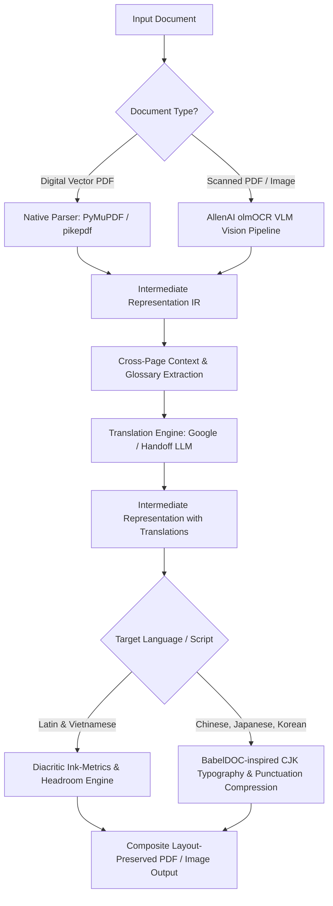

# Architectural Analysis & Next-Gen Roadmap for LayoutLingua

This document details the architectural insights drawn from analyzing state-of-the-art document translation projects—**PDFMathTranslate**, **BabelDOC** (`funstory-ai/BabelDOC`), and **AllenAI olmOCR** (`allenai/olmocr`), combined with LayoutLingua's specialized diacritic typesetting rules—and outlines how LayoutLingua synthesizes their best paradigms to become the definitive layout-preserving translation engine.

---

## 1. Deep Comparative Analysis of Reference Architectures

| Dimension | PDFMathTranslate (`pdf2zh`) | Precision Diacritics Engine | BabelDOC (`funstory-ai/BabelDOC`) | AllenAI olmOCR (`allenai/olmocr`) | **LayoutLingua Target State** |
| :--- | :--- | :--- | :--- | :--- | :--- |
| **Primary Focus** | Formula preservation in academic PDFs | Vietnamese diacritics & font spacing | Multilingual academic papers & Chinese CJK | Scanned PDFs, images, multi-column OCR | Complete unified engine for digital & scanned docs |
| **Parsing Model** | Direct PDF operator stream & layout heuristics | Same as base + Vietnamese text extraction | **Intermediate Representation (IR)** decoupling visual layout from semantics | Vision-Language Models (Molmo, Qwen2-VL) | **Hybrid IR Pipeline**: PDF native stream + VLM vision fallback |
| **Language & Scripts** | English to Chinese primarily | English to Vietnamese (Latin scripts) | English, Chinese, Japanese, Korean, Multilingual | Language-agnostic vision extraction | **Global Multilingual** (Latin, Vietnamese, CJK, RTL) |
| **Typography Engine** | Basic scaling & word-wrap | Specific Vietnamese tone-mark headroom rules | Adaptive typesetting, CJK punctuation compression | N/A (Markdown output) | Font cascade + diacritic ink-metrics + CJK wrap |
| **Context Scope** | Isolated sentence/block level | Block level | **Document-level** with cross-page context & glossaries | Page / multi-page visual context | Document-level glossary + cross-page stitching |
| **Scanned/Image Docs** | ❌ None (rejects image scans) | ❌ None | Limited OCR fallback | **State-of-the-Art VLM OCR** with LaTeX & coordinates | **Integrated olmOCR pipeline** with background inpainting |

---

## 2. Key Engineering Lessons & Paradigms to Adopt

### A. From `PDFMathTranslate` (Upstream Foundation)
1. **Mathematical Operator Preservation:**
   - Detect TeX math fonts and monospace code fonts (Consolas, Menlo, Fira Code) at the glyph level.
   - Replace complex equations with immutable placeholders (e.g., `<b0></b0>`) during translation, ensuring mathematical formulas are never corrupted by MT services or LLMs.
2. **Dual-Page Layout & Color Retention:**
   - Preserve original drawing streams, vector lines, borders, and text colors.

### B. Specialized Diacritic Typography & Headroom Rules
1. **Vertical Ink-Metric Calculation:**
   - Vietnamese stacked tone marks reach `0.890 em` above the baseline, and dot-below vowels drop `0.210 em` below it (compared to `0.695 / 0.210` in English).
   - Strict `1.2` line-height multiplier floor prevents overlapping tone marks.
2. **Native Font Cascade:**
   - Windows fallback prioritizing Times New Roman and Arial, avoiding missing glyph rectangles ("tofu").

### C. From `BabelDOC` (`funstory-ai/BabelDOC`)
1. **Decoupled Intermediate Representation (IR):**
   - Decouple layout geometry (bounding boxes, font metrics, reading order) from textual content.
   - Allows translation, terminology normalization, and post-editing to occur independently of rendering.
2. **Cross-Page Context & Sentence Re-Stitching:**
   - Academic papers frequently break sentences across page boundaries or between columns.
   - Merging fragmented spans before translation eliminates nonsensical translations at page borders.
3. **Chinese & CJK Typography Engine:**
   - CJK languages do not use whitespace to delimit words, rendering naive word-wrap algorithms useless.
   - Implementing punctuation compression (avoiding punctuation marks at line starts) and dynamic character-spacing adjustments.
   - Seamless CJK font cascade (Noto Sans CJK SC/TC/JP/KR).
4. **Glossary-Constrained Translation:**
   - Extract domain-specific terminology prior to translation to enforce consistent term mappings across a 50-page document.

### D. From `AllenAI olmOCR` (`allenai/olmocr`)
1. **Vision-Language Model Parsing for Scans:**
   - Using fine-tuned VLMs to parse complex scanned pages directly into clean Markdown with LaTeX math formulas and bounding boxes.
2. **Natural Handling of Non-Standard Layouts:**
   - Easily handles multi-column layouts, wrapped text around figures, and low-contrast scanned text that break traditional PDF text extractors.
3. **Bounding Box Grounding:**
   - Associating extracted text segments with precise bounding coordinates on the page image, enabling downstream inpainting and re-typesetting.

---

## 3. LayoutLingua Architectural Roadmap

### Phase 1: Foundation & Standalone Core (Completed)
- [x] Complete brand transition to `LayoutLingua` under `ThanhNguyxnOrg`.
- [x] 100% English UI, CLI, error handling, Android companion app, and workflows.
- [x] Automated update engine for desktop and Android.
- [x] Support for 36 Latin-script languages + specialized Vietnamese typesetting.
- [x] Formula and table preservation contract.

### Phase 2: Chinese & CJK Expansion (Inspired by BabelDOC)
- [ ] **Intermediate Representation (IR) Pipeline:** Refactor internal data structures to separate layout metadata from translation text spans.
- [ ] **Cross-Page Paragraph Stitching:** Detect sentences split across page breaks and unify them before translation.
- [ ] **CJK Font Cascade Integration:** Bundle Google Noto Sans CJK fallbacks for Simplified Chinese, Traditional Chinese, Japanese, and Korean.
- [ ] **Punctuation Compression & Kinboku Shori:** Implement CJK line-breaking and punctuation formatting rules.
- [ ] **Document Glossary Enforcement:** Support custom glossary dictionaries and automated terminology extraction.

### Phase 3: Vision & Scanned Document Translation (Integrated with olmOCR)
- [ ] **olmOCR Pipeline Integration:** Ingest scanned PDFs and images, extracting text, tables, and formulas with bounding box groundings.
- [ ] **Image Inpainting Layer:** Integrate LaMa (Large Mask Inpainting) to erase original text from scanned pages.
- [ ] **Visual Composite Typesetting:** Overlay translated text onto inpainted background plates matching original orientation, slant, and size.
