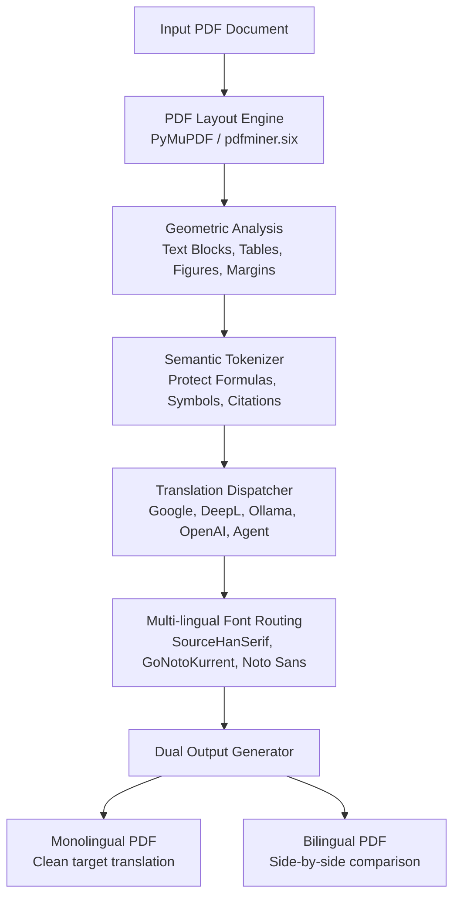

# Developer & Contributor Guide

Welcome to the **LayoutLingua** developer documentation. This guide explains the core document translation workflow, architecture, local development setup, testing, native platform builds, and the cloud-automated CI/CD release pipeline.

---

## 1. System Architecture & Core Translation Pipeline

LayoutLingua processes complex technical documents (PDFs, research papers, manuals) without destroying original spatial layouts, mathematical equations, or font typography.



### Core Pipeline Stages:

1. **Geometry & Layout Extraction (`pdf2zh/layout.py`):**
   - Extracts bounding boxes for characters, lines, and blocks.
   - Merges fragmented text spans into natural paragraph units while preserving columns and reading orders.
   - Detects and preserves non-text graphical elements (charts, tables, diagrams).

2. **Semantic Formula & Notation Protection (`pdf2zh/rules.py` & `pdf2zh/converter.py`):**
   - **Formulas & Math:** Isolates inline equations ($E=mc^2$) and multi-line LaTeX blocks using grammar-preserving token placeholders (`{{LL_F_xxx}}`).
   - **Calculus & Physics:** Protects differential operators ($\partial, \nabla$), multi-integrals ($\iint, \iiint, \oint$), and vectors.
   - **Chemistry:** Protects chemical reactions, reversible arrows ($\rightleftharpoons, \leftrightarrow$), state symbols, and stoichiometry numbers.
   - **Code & Citations:** Protects inline code tokens, variable names, URLs, bibliography tags (`[1]`, `[Smith et al.]`).

3. **Translation Dispatcher (`pdf2zh/translator.py`):**
   - Dispatches batches of prose text asynchronously to selected translation engines (Google Free, DeepL API, Ollama Local LLMs, OpenAI, Azure, Zhipu, etc.).
   - Includes **Agent Handoff Mode**, dumping translatable chunks to JSONL for direct processing by AI coding agents (Claude, Codex, Gemini).

4. **Multi-lingual Font Matching & Typesetting (`pdf2zh/high_level.py`):**
   - **Latin / European / Vietnamese:** Rendered using high-legibility Unicode fonts with full diacritic metric support.
   - **CJK (Chinese, Japanese, Korean):** Automatically routed to `SourceHanSerif` or system CJK serif/sans fonts.
   - Font scaling and line-height adjustments ensure translated text fits inside original bounding boxes without text overflows.

5. **Document Rendering:**
   - Synthesizes the target layout and produces both translated monolingual documents and dual-language comparison documents.

---

## 2. Local Environment Setup

### Prerequisites
- Python 3.12+
- Git

### Clone & Install
```bash
git clone https://github.com/ThanhNguyxnOrg/LayoutLingua.git
cd LayoutLingua

# Create and activate virtual environment
python -m venv .venv
# Windows:
.venv\Scripts\activate
# macOS / Linux:
source .venv/bin/activate

# Install dependencies
pip install -r requirements.txt
pip install -r requirements-app.txt

# Fetch bundled layout models and fonts
python scripts/fetch_assets.py
```

---

## 3. Automated Testing

LayoutLingua maintains a test suite covering layout preservation, grammar-aware formula placeholders, scientific symbols, multi-lingual prose detection, and font routing.

### Fast Local Test Runner
Run all unit tests locally using the fast test runner:
```bash
python scripts/test.py

# Verbose output:
python scripts/test.py -v
```

### Automated GitHub Actions CI (`.github/workflows/test.yml`)
- **Runs on Every Commit:** Every `git push` or `pull_request` to `main` touching code files (`pdf2zh/**`, `app/**`, `scripts/**`, `tests/**`, `*.py`) triggers GitHub Actions to run the full test suite in the cloud.
- **Smart Path Filtering:** Commits that only update documentation (`*.md`, `docs/`, `LICENSE`) automatically skip CI to conserve GitHub Actions runner minutes.
- **Fail-Safe:** You don't need to worry about forgetting to run tests locally—GitHub Actions will verify your changes automatically.

---

## 4. Building Native Binaries

You can build native standalone bundles for all 4 supported platforms:

### Windows (x64)
```powershell
.\build.ps1
# Output: dist/LayoutLingua-windows.zip
```

### macOS (Apple Silicon or Intel)
```bash
bash build-macos.sh
# Output: dist/LayoutLingua-macos-apple-silicon.dmg or dist/LayoutLingua-macos-intel.dmg
```

### Linux (x86_64)
```bash
bash build-linux.sh
# Output: dist/LayoutLingua-linux-x86_64.tar.gz
```

### Android
```bash
cd android
./gradlew assembleRelease
# Output: app/build/outputs/apk/release/app-release.apk
```

---

## 5. Automated Cloud Release Pipeline (`.github/workflows/release.yml`)

Releasing is 100% cloud-automated via GitHub Actions. Developers never need to run release scripts locally or manually edit release tags.

### Triggering a Release
To publish a new official release across all 4 platforms simultaneously, commit with the `release: <version>` keyword:

```bash
git commit -m "release: 1.0.0"
git push origin main
```

*(Alternatively, push a Git tag: `git tag v1.0.0 && git push origin v1.0.0`)*

### What the Release Workflow Does:
1. **Version Detection:** Detects `1.0.0` from the commit message or tag.
2. **Version Sync:** Automatically injects the target version into `app/update.py` and `android/app/build.gradle.kts`.
3. **Multi-Platform Matrix Build:** Builds Windows, macOS, Linux, and Android artifacts in parallel runner jobs.
4. **Changelog Extraction:** Extracts release notes corresponding to `## [1.0.0]` from [CHANGELOG.md](../CHANGELOG.md).
5. **Publishing:** Creates GitHub Release `v1.0.0`, attaches all 4 platform binaries, and publishes release notes.
6. **Tag & Branch Maintenance:** Pushes git tags (`v1.0.0`, `android-v1.0.0`) and commits version file updates back to `main` with `[skip ci]`.
